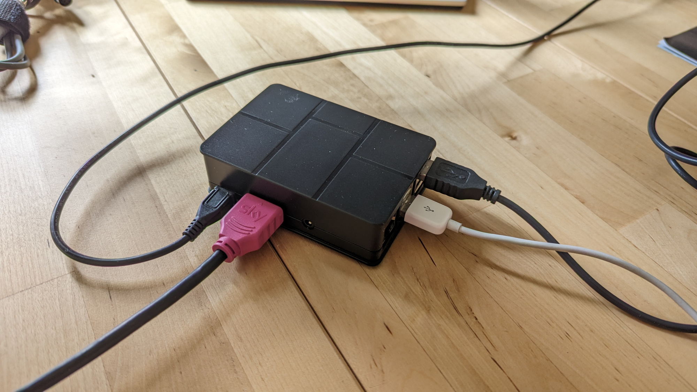
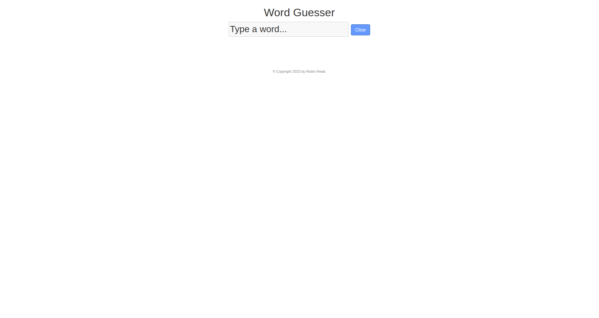
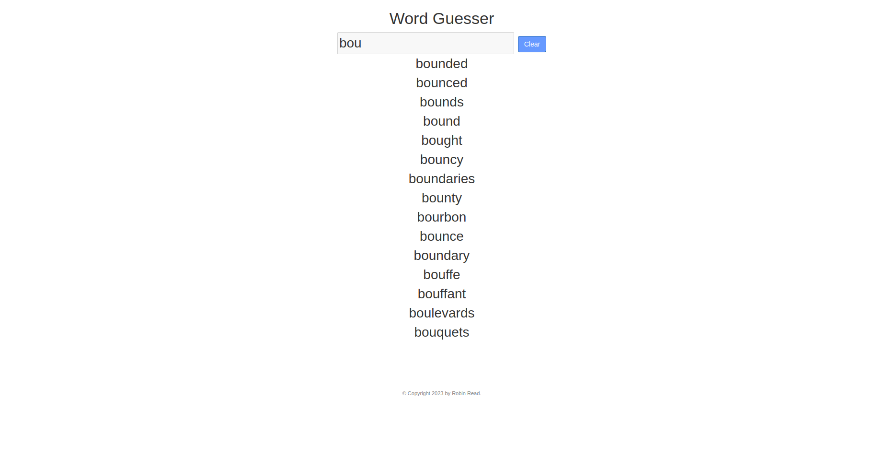
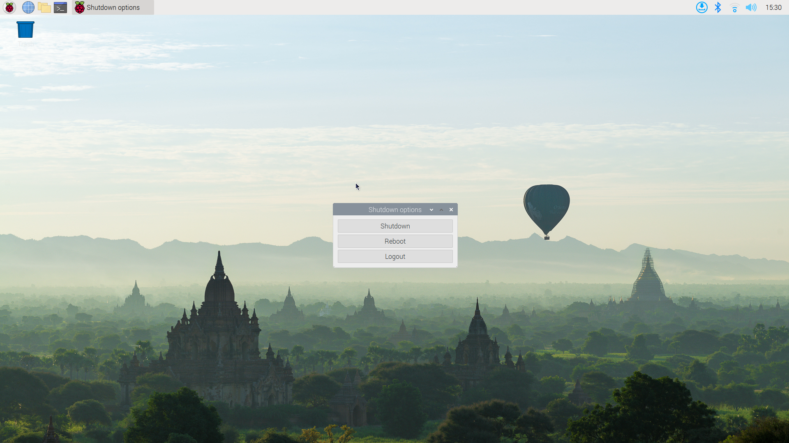

# Instructions

This computer (called a Raspberry Pi) runs a small program on it which is designed to "guess" words based upon some letters that are entered. For example, the letters "ba" can be part of:

- bagel
- ball
- band
- bandage

The motivation for this program is to help individuals who struggle to pronounce words that they wish to say communicate a particular word.

## Setting Up the Raspberry Pi

Equipment Needed:

- Screen with HDMI Connection & Cable
- USB Keyboard
- 5V, 3A Micro USB Power Supply
- USB Mouse, optional, used mainly for updates.

Connect the cables as shown below:

Once the power has been connected, after about a minute you should see a computer Desktop. After approximately two minutes this should be followed by the main application window.

## Usage

When you see the main window, you can simply start typing some letters on the keyboard and you should see a list of candidate words appear with each character that you add. For example:

If you have made a mistake, you can use the **backspace** key to remove the last letter. If you want to clear all the letters, you can press the **delete** key.

If you wish to close the screen, you need to press **CTRL+F4**. This should bring you back to the Desktop. From there you can turn off the Raspberry Pi by clicking on the little red Raspberry Pi logo at the top-left of the screen, selecting the bottom logout option, and then clicking on Shutdown in the Dialogue Box that appears.

